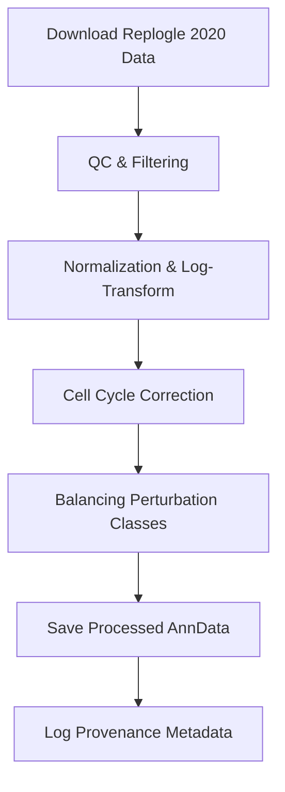

```mermaid
flowchart TD
    A[Download Replogle 2020 Data] --> B[QC & Filtering]
    B --> C[Normalization & Log-Transform]
    C --> D[Cell Cycle Correction]
    D --> E[Balancing Perturbation Classes]
    E --> F[Save Processed AnnData]
    F --> G[Log Provenance Metadata]
```